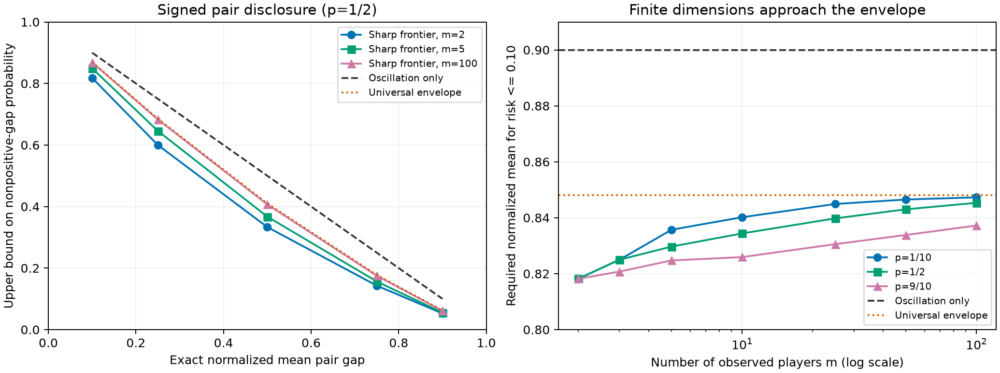

# C5: sharp completion rank-tail certificates — consolidated research result

2026-10-08. Branch `research/completion-disclosure-20261008`, based on
`7df2d0e5ed7f27b5c8f641af786dee840f5c94d6`. Remote main was checked at
`e7cac089d98500ac57771d419dff46804ced52c3`; no incoming main change. The worktree
was clean before branching. This stage adds files; historical source, configs,
results, README, inspected finance splits and local ignored runs are preserved.

## Result and decision

**C5 passes the configured mathematical/software audit.** It gives a sharp
relationship between an exact mean signed SHAP pair gap and the probability
that missing-data completion does not preserve that pair's strict ordering.
The full truth-table extremum reduces to a fractional knapsack with **m-1
cardinality cells**, and is attained even when the prediction at the observed
record is constant across completions. It improves the generic bound based
only on attribution oscillation.

**Novelty remains a specific, provisional mathematical claim**, not established
paper-level originality: the candidate delta is the exact SHAP-specific frontier,
its attainable examples, and the cardinality reduction. Neither probabilistic
ranking, selective explanation, Shapley integrals, fractional knapsack, nor
decision certificates are new. The bounded primary-paper search below did not
locate the same frontier; this cannot establish priority. No financial or human
benefit, practical runtime advantage, or new explainer is claimed.

The independent AI reviewers agreed with the core derivation and emphasized
these limits. Their agreement is not human peer review or proof of novelty.

## The precise question now answered

Fix a bounded raw model f in [0,1], m>=2 observed binary SHAP players at query
A=1, and **one hidden SHAP player H**. Use interventional SHAP with reference
P=Bernoulli(p)^m x q and completion law Q=(A=1,H~q), with the same q in both.
For a declared pair, define Delta=phi_i-phi_j, mu=E_Q Delta, t=mu/(1-p)>=0.
Failure means Delta<=0, **including ties**. All assumptions matter; this is a
signed pair target, not an absolute-SHAP or top-k target.

For two observed features, the exact sharp bound is

\[
Q(\Delta\le0)\le \frac{1-t}{1+t}.
\]

For general m, the proof and rational implementation define the strictly
decreasing frontier F_m,p(z). If t>=F_m,p(alpha), the pair can be disclosed
with nonpositive-gap mass at most alpha **under this Q**. The universal envelope
gives the simpler bound

\[
Q(\Delta\le0)\le
\left[\frac{a+\sqrt{a^2+8a}}4\right]^2,
\qquad a=1-t.
\]

The exact finite frontier is at least as tight as this envelope. The envelope
is approached as m grows at fixed p. Complete derivation, sharpness, inverse
monotonicity, scope and prespecified checks:
[COMPLETION_RANK_FRONTIER.md](../../../docs/COMPLETION_RANK_FRONTIER.md).

At t=0.5 and p=0.5, the executed rational calculations give:

| Information used | Upper bound on nonpositive pair gap |
|---|---:|
| Generic oscillation-only bound | 0.500000 |
| C5, m=2 | 0.333333 |
| C5, m=5 | 0.367105 |
| C5, m=100 | 0.406774 |
| Dimension-free C5 envelope | 0.410097 |

These are mathematical worst-case bounds, not observed default/revision rates.
For a 10% risk budget, m=2 requires t>=9/11=0.818182, compared with t>=0.9
for the oscillation-only certificate. Thus there is a strict, nonempty range
of exact means for which C5 certifies a pair and the generic bound does not.
This does not show that real financial records occupy that range.



The plot joins prespecified computed points; the right panel uses a restricted
y-axis to show certificate differences. [PDF](rank_frontier.pdf). No financial
data are plotted. Figure export and visual inspection completed without warnings.

## REPRODUCED — actually executed in this stage

Run: `runs/decision_value_pilot/rank_frontier_20261008T091400Z`.
Its manifest creation time is **09:10:43 UTC** and completion **09:10:55 UTC**;
the directory tag is a unique identifier, not the execution clock. CPU only,
one numeric thread. **94 tasks, 607 output rows, 2.466222 seconds of summed
task work**, with an actual pause between the first task and continuation.
The continuation itself took 2.515852 seconds wall time. No warnings in the
configured mathematical run.

| Executed check | Count / result |
|---|---|
| Binary hidden-law full truth-table LPs | 180; m=2..5, p=0.1/0.5/0.9, five failure masses, c=0/0.5/1 |
| Three-state hidden-law LPs | 216; six nonempty proper event subsets per (m,p,c) |
| All LP comparisons | 396 pass; maximum absolute error 2.220446049250313e-16 |
| Independent exact coalition/mixture coefficient comparisons | 156 pair-operator vectors, plus two for the law-mismatch falsifier |
| Exact rational attaining-table checks | 396; each bad-state gap exactly zero, good gaps positive |
| Strict-reversal perturbations | 180; negative bad gaps, positive good gaps, means below the tie frontier |
| Finite-dimension threshold calculations | 105; m=2,3,5,10,25,50,100; three p values; five risk budgets |
| Inverse certificates | 105; conservative rational bisection endpoint verified to a 2^-64 bracket |
| Deliberate reference/completion mismatch | One exact counterexample; expected assumption failure |

The oracle builds the SHAP operator from coalition and background sums. It
does not use the new mixture formula. The LP permits every bounded truth-table
entry to vary, fixes each all-observed-one prediction to c, and constrains every
declared bad hidden state separately. It is therefore a stronger correctness
control than checking the constructive example alone. LP extremizers are
synthetic mathematical witnesses, not fitted predictors or selected finance
models. Larger-m curves use the exact reduced formula; **full truth-table
LP/SHAP enumeration above m=5 is NOT RUN**.

Artifacts: [binary LPs](binary.csv), [multi-state LPs](multistate.csv),
[thresholds](threshold.csv), [inverse certificates](certificate.csv),
[execution receipt](execution_receipt.json), [manifest](manifest.json).

### Necessary-law falsifier

The same bounded model has two hidden states, reference masses (0.01,0.99),
and p=0.5. Its exact normalized pair gaps are (-0.01,0.99). Reweight only
completion Q to (0.5,0.5). Then t=0.49 and failure mass=0.5, whereas blindly
using the matched-law formula would assert 51/149=0.342282. This **violates
the out-of-scope certificate**, as intended. [Exact receipt](law_mismatch.csv).
The API cannot infer whether a caller's mean came from a matching law; that
assumption must be verified outside the numeric frontier function.

### Software and resume

The new tests passed, then the full suite finished with **192 passed, 1 skipped
(MPS hardware unavailable), 3 pre-existing SHAP plotting deprecation warnings**.
Pytest time 24.01s, process wall time 25.194835s. [Test receipt](pytest_final.json).

The actual research run paused after one task, then resumed 93 tasks while
verifying the completed task. A later complete resume verified all **94** and
computed **zero** new tasks. A separate disposable run rejected both a changed
config hash and a corrupted completed output. The actual research outputs were
not corrupted. [Guard receipts](guard_checks.json). All JSONL progress, tqdm/ETA
output and full pytest/guard logs remain in ignored local run directories.

### Exploratory challenge: several hidden players

After the C5 audit, a separate challenge asked whether the m=2 frontier
survives k independent, uniform hidden bits kept as **separate** SHAP players.
This was an exploratory extension, not part of the frozen 94-task protocol.
Its operator is M=integral_0^1 T_t dt, where T_t independently retains each
hidden bit with probability t and otherwise resamples it. A Walsh term of
degree r has eigenvalue 1/(r+1). This is standard Boolean-noise algebra, not
a new spectral claim. The proposed inequality for this different operator is
still **UNPROVED**.

The coordinator implemented a positive coalition expansion independently of
the reviewer's alternating polynomial expansion, and **actually reran 35 full
LPs** for k=2..8: singleton, coordinate half, two Hamming-ball rules, and a
codimension-two subcube. The full-cube k=2 case is retained as a zero-mean
control; case labels can duplicate sets. These are selected cases, not an
exhaustive search over failure sets. On k<=3, a direct coalition SHAP oracle
also checked the LP witness at every hidden state (60 completed queries).

- No counterexample in those 35 cases; maximum excess over the conjectured
  frontier 5.551115123125783e-17, consistent with numerical error.
- Maximum direct-coalition error 2.220446049250313e-16. Maximum difference
  from the reviewer's saved 35 LP objectives 1.3700152123874432e-13.
- Coordinate halfspaces attain normalized mean 1/3 at failure mass 1/2.
  This special case follows directly from the degree-one eigenvalue and does
  not prove the conjecture for arbitrary sets.
- CPU task work 0.172846s, no warnings, with a real one-task pause, continuation,
  and complete resume reusing all 35 outputs without recomputation. Run:
  `runs/decision_value_pilot/rank_multiple_hidden_20261008T092700Z`; actual
  creation 09:25:51 UTC, completion 09:26:12 UTC.

[LP witnesses/results](multiple_hidden_results.json) and
[execution receipt](multiple_hidden_execution.json). The committed
`scripts/challenge_multiple_hidden_rank.py` reproduces this limited challenge.

Separately, the reviewer reported 600 random weighted-threshold **candidate
draws** per k=3..8. Artifact inspection corrected the count: after duplicates
and whole/empty-set exclusions there were **2,825 unique LPs**, not 3,600
independent LPs. The coordinator checked all four saved source/result hashes
and archived the bytes locally, but **did not rerun this random search**.
[Artifact-audit receipt](multi_hidden_agent_artifact_audit.json). These checks
do not justify applying C5 to several hidden players; that extension remains
a conjecture requiring a proof or counterexample.

## REPORTED — prior evidence read, not rerun here

- C3's bounded scalar/contrast theorem and C4's generalized-Khintchine prior
  collision are from the preceding stage. C5 is a new tail-risk question;
  this report does not count the preceding LPs/tests as new execution.
- The historical Taiwan/Polish results, F0 utility audit, F1 task artifacts and
  F2 inference simulations were not rerun. No new inference about human or
  financial outcomes follows from the present synthetic theorem checks.
- AI reviewers described additional in-memory spot checks. Those without
  retained verifiable artifacts are review reports, not included in the counts
  above. One reviewer reported correcting a scratch coalition-query error;
  that scratch output is not evidence for C5. The coordinator's definition
  oracle and committed audit are the result source.

## Generation, alternatives and adversarial review

The scientific-brainstorming workflow used a fresh independent ideation round
with three AI reviewers before exposing the coordinator's C5 derivation.
Selection criteria were fixed qualitatively: concrete disclosure target;
mathematical nontriviality beyond generic tools; independent falsifiability;
tractable local audit; and a primary-literature comparison. No weighted novelty
score or majority vote was used. These AI perspectives do not substitute for
domain participants or expert review.

| Candidate | Provenance | Decision in this stage |
|---|---|---|
| Signed support certificate / action-fiber entailment | Theory/problem reviewers, independent | Standard robust/abductive certificate framing; not pursued as standalone novelty |
| Attribution-invariance null-space quotient | Theory reviewer, independent | Routine linear-algebra/manipulation corollary; NO-GO standalone |
| Ordered hidden-contrast envelope via min-cut | Algorithm reviewer, independent | Valid-looking order-polytope application; generic closure/min-cut prior, exponential Boolean lattice; NOT RUN by coordinator |
| Symmetric spectral/energy envelope | Algorithm reviewer, independent | Too close to known SHAP operator norms; NO-GO standalone |
| Same moments, different support-wise safety | Problem reviewer, independent | Potential illustrative counterexample; standard moment nonidentifiability risk; NOT RUN by coordinator |
| C5 exact mean/rank-failure frontier | Coordinator, independent of the above proposals | Selected for exact LP/operator audit; narrow originality PROVISIONAL |

Non-originator reviews checked the positive-mixture derivation, the knapsack
reduction, ties versus strict reversal, constant prediction **slice**, fixed-q
limits and exact-mean assumption. The strongest unresolved objection is that
reviewers may regard the specialized frontier as a routine LP corollary rather
than a substantial contribution. Another is practical value: on a small finite
support, directly computing Q(Delta<=0) dominates this worst-case certificate.
For one scalar hidden feature in a compact threshold tree, the completion cells
may already be few; no computational separation has been established.

## Primary-literature collision audit

Read/search date: 2026-10-08. Representative queries included `Shapley rank
stability expected attribution probability rank reversal missing features sharp
bounds`, `SHAP ranking uncertainty expected margin probability sharp bound
completion`, `Shapley fractional knapsack ranking`, and targeted paper titles.
The search was bounded and not a systematic review; search absence is not novelty.

| Primary source inspected | Overlap already known | C5 difference, as an inference from the inspected scope |
|---|---|---|
| [Lin, Covert & Lee, NeurIPS 2023](https://arxiv.org/html/2306.07462v2), Sec.3.3/4, App.D | Linear attribution operators and robustness norms | Specific exact mean-to-completion-tail frontier, rather than a generic norm bound |
| [Goldwasser & Hooker, UAI 2025](https://proceedings.mlr.press/v286/goldwasser25a.html), [full preprint v4](https://arxiv.org/html/2401.15800v4), Sec.2–5 | High-probability feature ranking and top-K verification | Their uncertainty is sampling of attribution/global-score estimates; C5 assumes exact mean and concerns random completed inputs |
| [Neuhof & Benjamini, AISTATS 2024](https://proceedings.mlr.press/v238/neuhof24a.html), [paper](https://proceedings.mlr.press/v238/neuhof24a/neuhof24a.pdf), Sec.1–3 | Pair comparisons and simultaneous rank confidence intervals | Their global FI sampling target differs from a fixed incomplete record's completion law |
| [Cifuentes et al., ECAI 2024](https://arxiv.org/abs/2401.12731), abstract/scope | Tight SHAP ranges over uncertain reference distributions | C5 fixes P and studies completed-query pair gaps; reference-law uncertainty is not covered |
| [Utkin et al., Imprecise SHAP, 2021](https://arxiv.org/abs/2106.09111), abstract/scope | Interval-valued Shapley values and linear optimization under sets of class-probability distributions | LP-based attribution uncertainty is prior art; C5's proposed delta is its particular completion-tail frontier |
| [Probabilistic Shapley Value Modeling and Inference, v2](https://arxiv.org/html/2402.04211v2), Sec.3.1/4.2 | Stochastic attributions and probabilistic ranking | Learned Gaussian attribution distributions differ from the exact bounded-model extremum under Q |
| [Selective Explanations, NeurIPS 2024](https://papers.nips.cc/paper_files/paper/2024/hash/647af5f6b2538524f6c047c1d9170fd9-Abstract-Conference.html) | Selective explanation/quality control | C5 is not a new selective-release idea; only its specialized certificate could be a delta |
| [Jin et al., 2025, v3](https://arxiv.org/html/2504.13787v3), Def.2.3, Thm.3.1, Sec.4 | Probabilistic stability certification and Boolean smoothing analysis | Their stability rate concerns prediction preservation under feature-mask perturbations; C5 concerns signed SHAP ordering |
| [Yang, Yoder & Zentefis, 2026](https://cowles.yale.edu/research/cfdp-2552-explanations-robust-decisions), abstract | Explanations as information and lower-bound decision certificates | Strong conceptual prior; C5 supplies no new general decision-value theorem |
| [Attacking Power Indices by Manipulating Player Reliability, AAMAS 2019](https://www.ifaamas.org/Proceedings/aamas2019/pdfs/p538.pdf) | Shapley-related optimization already reduces to fractional knapsack | No claim that combining Shapley and knapsack is novel |

No empirical results from these papers were reproduced. Sampling ranking
algorithms are relevant methodological baselines but do not compute the same
population-tail estimand; they were not run and are not shown as beaten.

## PROPOSED and NOT RUN

The result is suitable for a narrowly scoped theory note and further prior-art
challenge. Practical advancement requires a setting where the assumptions are
defensible and an exact/rigorously bounded mean is cheaper than direct tail
evaluation. An estimated mean needs its own valid lower confidence bound;
that statistical extension is not implemented. The API's floating universal
formula is for numerical presentation, while finite inverse certificates return
conservative rational endpoints.

NOT RUN: finance model fitting or evaluation; Taiwan/Polish selection; human
study or recruitment; MPS/GPU execution; clinical/financial utility; absolute
SHAP or simultaneous top-k certificates; dependent/heterogeneous reference
extensions; end-to-end runtime comparison against exact completion enumeration
or direct probability sampling; external expert peer review.

## Reproduce and resume

The manifest hashes code, config, protocol, tests, lockfile and dependency
versions. Resume rejects drift; use a new uniquely named output directory for
a modified experiment. Commands below preserve historical artifacts.

```bash
rtk proxy .venv/bin/python scripts/run_completion_rank_audit.py \
  --output runs/decision_value_pilot/rank_frontier_20261008T091400Z --resume

# For a fresh reproduction, choose a new empty directory and omit --resume.
rtk proxy .venv/bin/python scripts/validate_completion_rank_run.py \
  --run runs/decision_value_pilot/rank_frontier_20261008T091400Z \
  --output runs/decision_value_pilot/rank_validation_NEW_UNIQUE_ID

rtk proxy .venv/bin/python scripts/report_completion_rank.py \
  --run runs/decision_value_pilot/rank_frontier_20261008T091400Z \
  --validation runs/decision_value_pilot/rank_validation_20261008T091800Z \
  --output reports/completion_rank/NEW_UNIQUE_ID

rtk proxy .venv/bin/python scripts/challenge_multiple_hidden_rank.py \
  --output runs/decision_value_pilot/rank_multiple_hidden_20261008T092700Z --resume
```

There was no merge to main. Publication verification is recorded in
`publication.json` after pushing this research branch.
