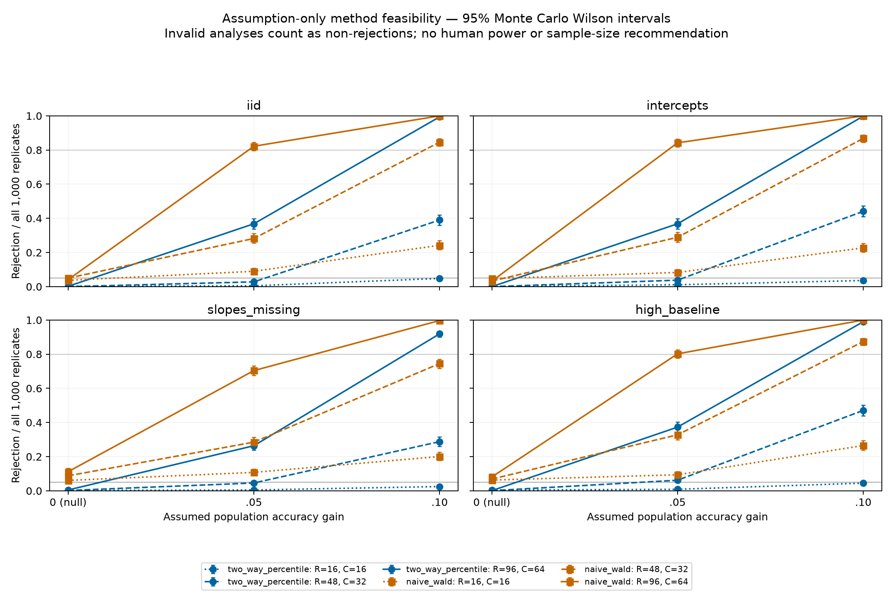

# F2 inference feasibility — actual simulation, no human evidence

## Decision and scope

Executed all 36 prespecified hypothetical scenarios, each
with 1000 independent outer replicates and 499
two-way bootstrap draws. The candidate bootstrap passes the prespecified
inflation/invalid screening gate in **10/12**
null settings; **12/12** are flagged
conservative (null rejection below .025). The naive comparator passes
**6/12** null settings.

These results diagnose this secondary candidate procedure under the frozen laws.
They do not validate the planned primary logistic mixed model, choose a method,
establish human benefit, or justify a final sample size. A gate pass is not proof
of exact .05 type-I error. No cutoff, method or scenario was tuned after results.

## VERIFIED — actually run in this stage

- CPU run `inference_20261007T162910Z`, started `2026-10-07T16:30:54.682435+00:00`;
  base `f5ae1de5708a5c118cceff8dd04e25c62d59a551`, branch `research/decision-value-inference-sim-20261007`.
- 36,000 simulated trials, two analyses each;
  17,964,000 bootstrap draws attempted.
  Sum of measured simulation-chunk elapsed times: **81.40 seconds**.
  This excludes tests, plotting, setup, pauses and work before the run.
- Python `3.11.16`, platform `macOS-26.2-arm64-arm-64bit`, actual device CPU.
  Dependency versions and all source/config/protocol hashes: `execution_receipt.json`.
- Marginal arm probabilities calibrated by 64-node Gaussian quadrature and checked
  with 128 nodes; largest target error
  **2.78e-15**.
  Random slopes at gain zero implement a weak marginal null, not a sharp null.
- Real intentional pause recorded: **True**; verified reused chunk receipts:
  **1** at report creation. Index-addressed independent data/bootstrap RNG
  streams, 50-replicate checkpoints, SHA256 checks, JSONL progress and tqdm/ETA.
- No participant observations, predictor training, Taiwan/Polish model selection,
  new clinical/financial dataset or simulated individual-rating export.
  Tests and final preservation/push checks are recorded in `validation_receipt.json`.
  That receipt also lists development failures and repeated attempts; repeated
  same-seed executions are not independent confirmation.

## Null calibration — all prespecified settings

Two-sided alpha .05; Wilson upper <=.075 and invalid fraction <=.01 is the
frozen diagnostic gate. Invalid analyses count as non-rejections in all 1,000.
Conservative rejection can coexist with a gate pass and imply weak power.

| reviewers | cases | profile | method | rejection_rate | rejection_wilson_upper | invalid_fraction | null_screen_pass | conservative_flag |
| --- | --- | --- | --- | --- | --- | --- | --- | --- |
| 16 | 16 | iid | two_way_percentile | 0.0030 | 0.0088 | 0.0000 | True | True |
| 16 | 16 | iid | naive_wald | 0.0370 | 0.0506 | 0.0000 | True | False |
| 16 | 16 | intercepts | two_way_percentile | 0.0010 | 0.0056 | 0.0000 | True | True |
| 16 | 16 | intercepts | naive_wald | 0.0470 | 0.0619 | 0.0000 | True | False |
| 16 | 16 | slopes_missing | two_way_percentile | 0.0020 | 0.0073 | 0.3270 | False | True |
| 16 | 16 | slopes_missing | naive_wald | 0.0610 | 0.0776 | 0.0000 | False | False |
| 16 | 16 | high_baseline | two_way_percentile | 0.0040 | 0.0102 | 0.3470 | False | True |
| 16 | 16 | high_baseline | naive_wald | 0.0630 | 0.0798 | 0.0000 | False | False |
| 48 | 32 | iid | two_way_percentile | 0.0000 | 0.0038 | 0.0000 | True | True |
| 48 | 32 | iid | naive_wald | 0.0500 | 0.0653 | 0.0000 | True | False |
| 48 | 32 | intercepts | two_way_percentile | 0.0000 | 0.0038 | 0.0000 | True | True |
| 48 | 32 | intercepts | naive_wald | 0.0330 | 0.0460 | 0.0000 | True | False |
| 48 | 32 | slopes_missing | two_way_percentile | 0.0020 | 0.0073 | 0.0000 | True | True |
| 48 | 32 | slopes_missing | naive_wald | 0.0880 | 0.1072 | 0.0000 | False | False |
| 48 | 32 | high_baseline | two_way_percentile | 0.0010 | 0.0056 | 0.0000 | True | True |
| 48 | 32 | high_baseline | naive_wald | 0.0690 | 0.0864 | 0.0000 | False | False |
| 96 | 64 | iid | two_way_percentile | 0.0020 | 0.0073 | 0.0000 | True | True |
| 96 | 64 | iid | naive_wald | 0.0410 | 0.0551 | 0.0000 | True | False |
| 96 | 64 | intercepts | two_way_percentile | 0.0000 | 0.0038 | 0.0000 | True | True |
| 96 | 64 | intercepts | naive_wald | 0.0320 | 0.0448 | 0.0000 | True | False |
| 96 | 64 | slopes_missing | two_way_percentile | 0.0050 | 0.0117 | 0.0000 | True | True |
| 96 | 64 | slopes_missing | naive_wald | 0.1120 | 0.1331 | 0.0000 | False | False |
| 96 | 64 | high_baseline | two_way_percentile | 0.0010 | 0.0056 | 0.0000 | True | True |
| 96 | 64 | high_baseline | naive_wald | 0.0810 | 0.0996 | 0.0000 | False | False |

## Conditional power under assumed effects

Effects .05 and .10 are sensitivity values, **not an expert-approved SESOI**.
Rows with a failed matched null screen must not be used for sample-size claims.
Wilson intervals describe finite outer-simulation uncertainty; 499 inner draws
also add Monte Carlo noise. Estimates are about this bootstrap/Wald procedure,
not about the unrun primary mixed model. No design is selected here.

| reviewers | cases | profile | effect | method | rejection_rate | rejection_wilson_lower | rejection_wilson_upper | null_screen_pass |
| --- | --- | --- | --- | --- | --- | --- | --- | --- |
| 16 | 16 | iid | 0.05 | two_way_percentile | 0.0050 | 0.0021 | 0.0117 | True |
| 16 | 16 | iid | 0.05 | naive_wald | 0.0900 | 0.0738 | 0.1093 | True |
| 16 | 16 | iid | 0.1 | two_way_percentile | 0.0480 | 0.0364 | 0.0631 | True |
| 16 | 16 | iid | 0.1 | naive_wald | 0.2420 | 0.2165 | 0.2695 | True |
| 16 | 16 | intercepts | 0.05 | two_way_percentile | 0.0110 | 0.0062 | 0.0196 | True |
| 16 | 16 | intercepts | 0.05 | naive_wald | 0.0830 | 0.0675 | 0.1017 | True |
| 16 | 16 | intercepts | 0.1 | two_way_percentile | 0.0360 | 0.0261 | 0.0494 | True |
| 16 | 16 | intercepts | 0.1 | naive_wald | 0.2270 | 0.2021 | 0.2540 | True |
| 16 | 16 | slopes_missing | 0.05 | two_way_percentile | 0.0050 | 0.0021 | 0.0117 | False |
| 16 | 16 | slopes_missing | 0.05 | naive_wald | 0.1080 | 0.0902 | 0.1288 | False |
| 16 | 16 | slopes_missing | 0.1 | two_way_percentile | 0.0250 | 0.0170 | 0.0366 | False |
| 16 | 16 | slopes_missing | 0.1 | naive_wald | 0.2010 | 0.1773 | 0.2270 | False |
| 16 | 16 | high_baseline | 0.05 | two_way_percentile | 0.0090 | 0.0047 | 0.0170 | False |
| 16 | 16 | high_baseline | 0.05 | naive_wald | 0.0940 | 0.0774 | 0.1137 | False |
| 16 | 16 | high_baseline | 0.1 | two_way_percentile | 0.0450 | 0.0338 | 0.0597 | False |
| 16 | 16 | high_baseline | 0.1 | naive_wald | 0.2650 | 0.2386 | 0.2932 | False |
| 48 | 32 | iid | 0.05 | two_way_percentile | 0.0280 | 0.0194 | 0.0402 | True |
| 48 | 32 | iid | 0.05 | naive_wald | 0.2820 | 0.2550 | 0.3107 | True |
| 48 | 32 | iid | 0.1 | two_way_percentile | 0.3900 | 0.3602 | 0.4206 | True |
| 48 | 32 | iid | 0.1 | naive_wald | 0.8460 | 0.8223 | 0.8670 | True |
| 48 | 32 | intercepts | 0.05 | two_way_percentile | 0.0380 | 0.0278 | 0.0517 | True |
| 48 | 32 | intercepts | 0.05 | naive_wald | 0.2890 | 0.2618 | 0.3179 | True |
| 48 | 32 | intercepts | 0.1 | two_way_percentile | 0.4410 | 0.4105 | 0.4719 | True |
| 48 | 32 | intercepts | 0.1 | naive_wald | 0.8680 | 0.8456 | 0.8876 | True |
| 48 | 32 | slopes_missing | 0.05 | two_way_percentile | 0.0460 | 0.0347 | 0.0608 | True |
| 48 | 32 | slopes_missing | 0.05 | naive_wald | 0.2850 | 0.2579 | 0.3138 | False |
| 48 | 32 | slopes_missing | 0.1 | two_way_percentile | 0.2880 | 0.2608 | 0.3168 | True |
| 48 | 32 | slopes_missing | 0.1 | naive_wald | 0.7450 | 0.7171 | 0.7710 | False |
| 48 | 32 | high_baseline | 0.05 | two_way_percentile | 0.0620 | 0.0487 | 0.0787 | True |
| 48 | 32 | high_baseline | 0.05 | naive_wald | 0.3280 | 0.2996 | 0.3577 | False |
| 48 | 32 | high_baseline | 0.1 | two_way_percentile | 0.4710 | 0.4402 | 0.5020 | True |
| 48 | 32 | high_baseline | 0.1 | naive_wald | 0.8740 | 0.8520 | 0.8931 | False |
| 96 | 64 | iid | 0.05 | two_way_percentile | 0.3680 | 0.3387 | 0.3983 | True |
| 96 | 64 | iid | 0.05 | naive_wald | 0.8220 | 0.7971 | 0.8445 | True |
| 96 | 64 | iid | 0.1 | two_way_percentile | 0.9940 | 0.9870 | 0.9972 | True |
| 96 | 64 | iid | 0.1 | naive_wald | 1.0000 | 0.9962 | 1.0000 | True |
| 96 | 64 | intercepts | 0.05 | two_way_percentile | 0.3680 | 0.3387 | 0.3983 | True |
| 96 | 64 | intercepts | 0.05 | naive_wald | 0.8420 | 0.8181 | 0.8633 | True |
| 96 | 64 | intercepts | 0.1 | two_way_percentile | 0.9980 | 0.9927 | 0.9995 | True |
| 96 | 64 | intercepts | 0.1 | naive_wald | 1.0000 | 0.9962 | 1.0000 | True |
| 96 | 64 | slopes_missing | 0.05 | two_way_percentile | 0.2640 | 0.2376 | 0.2922 | True |
| 96 | 64 | slopes_missing | 0.05 | naive_wald | 0.7040 | 0.6750 | 0.7315 | False |
| 96 | 64 | slopes_missing | 0.1 | two_way_percentile | 0.9190 | 0.9004 | 0.9344 | True |
| 96 | 64 | slopes_missing | 0.1 | naive_wald | 0.9970 | 0.9912 | 0.9990 | False |
| 96 | 64 | high_baseline | 0.05 | two_way_percentile | 0.3730 | 0.3436 | 0.4034 | True |
| 96 | 64 | high_baseline | 0.05 | naive_wald | 0.8020 | 0.7762 | 0.8255 | False |
| 96 | 64 | high_baseline | 0.1 | two_way_percentile | 0.9900 | 0.9817 | 0.9946 | True |
| 96 | 64 | high_baseline | 0.1 | naive_wald | 1.0000 | 0.9962 | 1.0000 | False |



`scenario_summary.csv` additionally includes coverage, bias, interval width,
valid-only rejection, invalid fraction, smallest finite-bootstrap fraction and
mean observed primary ratings. Coverage conditional on validity is labeled;
`coverage_all` counts failures as noncoverage. Small complete or MCAR samples
and a conservative procedure require both calibration and power checks.

## REPORTED from prior reports — not rerun

F0 utility audit, the 245-case rule baseline, selected 16-case fixture audit,
arm text-length differences and incomplete browser QA are historical evidence
from commits `eb6689c` and `f5ae1de`. This stage did not repeat those experiments
or repair/claim browser testing. No archive item became a new execution queue.

## PROPOSED and NOT RUN

- **NOT RUN:** human study, expert approval of task/rubric/SESOI, consent or
  recruitment, actual human timings/accuracy, primary GLMM fit/convergence/power,
  MAR/MNAR or differential attrition, larger sensitivity grids and any pilot.
- **PROPOSED:** retain this as a falsification/feasibility receipt for the
  secondary analysis; freeze a separate primary-analysis specification only
  after the task and meaningful effect are agreed. Do not tune using these
  outcomes and relabel an exploratory repair as this frozen run.
- **One next action:** domain expert/supervisor reviews the existing fixture
  and rubric with `docs/DECISION_VALUE_REVIEW_GUIDE.md`, including the fact that
  all answers are already recoverable from the current record in arm 1.

## Reproduce / resume

From the repository root with the existing locked environment:

```sh
rtk proxy .venv/bin/python scripts/run_decision_inference_sim.py --output runs/decision_value_pilot/inference_NEW
rtk proxy .venv/bin/python scripts/run_decision_inference_sim.py --output runs/decision_value_pilot/inference_NEW --resume
```

`--stop-after-chunks 1` provides a real pause after one newly completed chunk.
Resume rejects source/config/dependency drift and altered completed outputs.
Only an explicit aggregate allowlist is published; local replicate statistics,
logs and run receipts stay in the ignored run directory. Historical results and
configs, lockfile and main remain unchanged by this stage.

## Method references and limitations

The product-weight row/column construction follows the crossed-data resampling
idea in Owen (2007), [The pigeonhole bootstrap](https://arxiv.org/abs/0712.1111),
and Owen & Eckles (2012), [Bootstrapping data arrays of arbitrary order](https://arxiv.org/abs/1106.2125).
Their results are not a guarantee for this finite binary percentile interval.
Case resampling is stratified; reviewer/case balance can break within bootstrap
draws. MCAR, Gaussian effects, fixed four-stratum weights and Bernoulli outcomes
are assumptions, not measured properties of a future study.
