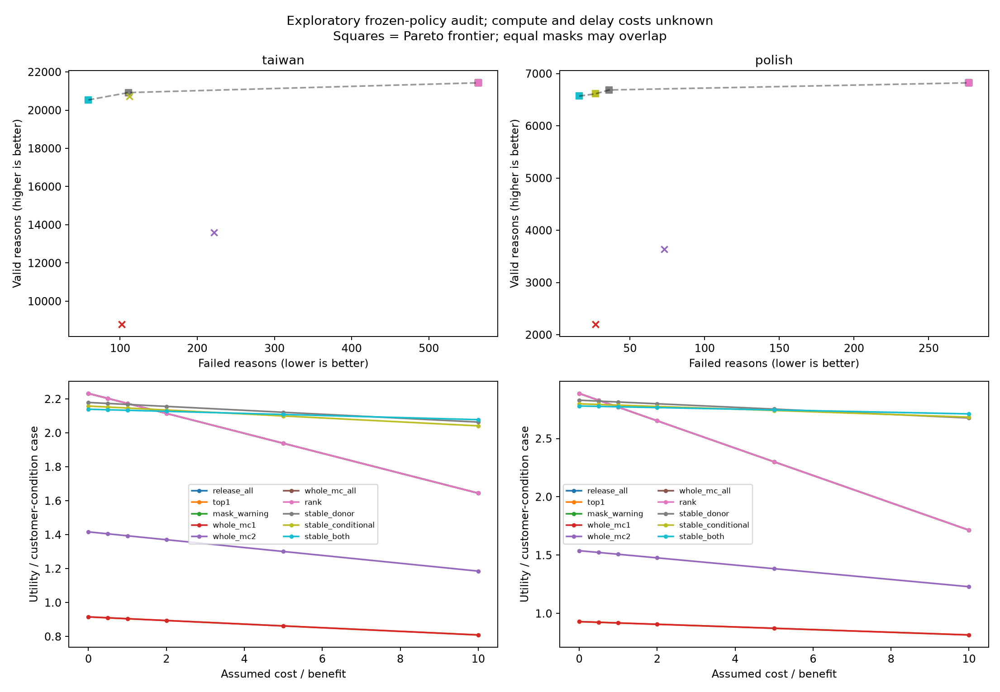

# Decision-value pilot — kết quả tổng hợp

Run `20261007T151716Z`; actual UTC start `2026-10-07T15:17:17.018797+00:00`. Run IDs are labels;
the manifest/progress timestamps are authoritative. Base main `e7cac089d98500ac57771d419dff46804ced52c3`;
branch `research/astra-next-run-20261007`. **F0 đã chạy; F1/F2 đã chuẩn bị; HUMAN STUDY NOT RUN.**
Đây là exploratory reuse trên Taiwan/Polish đã xem, không phải external confirmation.

## VERIFIED / REPRODUCED — thực sự chạy

- Đồng bộ lockfile; CPU `macOS-26.2-arm64-arm-64bit`, Python `3.11.16`.
- Kiểm tra SHA256 của 108 input/receipt files, trước và sau chạy;
  replay frozen release masks trước khi đọc verification labels; kiểm tra lại meaningful target.
- 192 count comparisons khớp historical metrics. Không thiếu artifact cần dùng;
  không cần recovery worktree hoặc refit/recompute SHAP. Historical results/configs giữ nguyên.
- Audit 2,400 Taiwan customers / 9,600 customer-condition cases (4 conditions), và
  1,182 Polish statements / 2,364 cases / 1,169 exact-feature clusters (2 conditions).
  Repeated masks không được tính là khách hàng độc lập; không xác nhận company identity.
- Utility grid cố định `[0,.5,1,2,5,10]`; 1,000 paired cluster bootstrap draws,
  seed 20261007, Taiwan stratified by historical fold. Tất cả 1,000 draws có denominator.
- Partial-run resume đã thực chạy: dừng sau Taiwan, xác minh hash và bỏ qua Taiwan
  khi tiếp tục Polish/frontier/vignettes. `progress.jsonl`, tqdm/ETA, stage receipts,
  source/input hashes và logs nằm local trong `runs/decision_value_pilot/20261007T151716Z`.
- Suite cuối: **128 passed, 0 failed, 1 skipped**,
  elapsed wall time 22.085s. Skip: MPS hardware unavailable
  trong môi trường test; actual research device CPU. Ba SHAP deprecation warnings.
  Suite ban đầu thật chạy: 119 passed / 1 failed / 1 skipped; lỗi hash provenance
  tìm hai docs đã chuyển archive. Chỉ sửa hai đường dẫn trong `source_hashes`, không
  đổi nội dung archive, config hay cơ chế fitting. Tests có synthetic model fits;
  không có training predictor nghiên cứu mới.

Actual audit stage timing (không phải online policy latency; có chạy đồng thời suite):

| stage | actual_elapsed_seconds |
| --- | --- |
| frontier | 9.172761 |
| polish | 0.238239 |
| taiwan | 0.515401 |
| vignettes | 0.036400 |

Initial plot render built a font cache. A development run first exposed non-writable
global plotting caches; final runner stores them under the ignored run directory.
A runtime-scope metadata correction was applied before this final run; the utility
grid is byte-identical to the development run. No policy, threshold or grid changed.

## Counts và baseline mạnh

Target duy nhất của bảng dưới: meaningful-positive failure **theo từng reason**.
Units của valid/failed/released/candidate là reasons; coverage denominator là mọi
customer-condition case, kể cả case không có candidate. Full condition tables và
denominators ở [utility_counts.csv](utility_counts.csv).

| dataset | method | valid_reasons | failed_reasons | released_reasons | candidate_reasons | coverage_ge1 | coverage_ge2 |
| --- | --- | --- | --- | --- | --- | --- | --- |
| taiwan | release_all | 21430 | 564 | 21994 | 21994 | 0.926146 | 0.719896 |
| taiwan | top1 | 8789 | 102 | 8891 | 21994 | 0.926146 | 0.000000 |
| taiwan | mask_warning | 21430 | 564 | 21994 | 21994 | 0.926146 | 0.719896 |
| taiwan | whole_mc1 | 8789 | 102 | 8891 | 21994 | 0.926146 | 0.000000 |
| taiwan | whole_mc2 | 13600 | 222 | 13822 | 21994 | 0.719896 | 0.719896 |
| taiwan | whole_mc_all | 21430 | 564 | 21994 | 21994 | 0.926146 | 0.719896 |
| taiwan | rank | 21430 | 564 | 21994 | 21994 | 0.926146 | 0.719896 |
| taiwan | stable_donor | 20920 | 111 | 21031 | 21994 | 0.913958 | 0.692708 |
| taiwan | stable_conditional | 20717 | 112 | 20829 | 21994 | 0.911354 | 0.687500 |
| taiwan | stable_both | 20537 | 59 | 20596 | 21994 | 0.908229 | 0.680104 |
| polish | release_all | 6823 | 277 | 7100 | 7100 | 0.941624 | 0.784687 |
| polish | top1 | 2199 | 27 | 2226 | 7100 | 0.941624 | 0.000000 |
| polish | mask_warning | 6823 | 277 | 7100 | 7100 | 0.941624 | 0.784687 |
| polish | whole_mc1 | 2199 | 27 | 2226 | 7100 | 0.941624 | 0.000000 |
| polish | whole_mc2 | 3637 | 73 | 3710 | 7100 | 0.784687 | 0.784687 |
| polish | whole_mc_all | 6823 | 277 | 7100 | 7100 | 0.941624 | 0.784687 |
| polish | rank | 6823 | 277 | 7100 | 7100 | 0.941624 | 0.784687 |
| polish | stable_donor | 6686 | 36 | 6722 | 7100 | 0.930626 | 0.749577 |
| polish | stable_conditional | 6613 | 27 | 6640 | 7100 | 0.929357 | 0.745770 |
| polish | stable_both | 6569 | 16 | 6585 | 7100 | 0.926396 | 0.740694 |

**Release-all là baseline mạnh.** Mask warning, whole-MC-all và rank release rule
đồng mask với release-all tại operating point này; top-1 đồng mask với whole-MC1.
Không được diễn giải utility bằng nhau là tác động người dùng bằng nhau. Các phép
so sánh rank ở đây không phải chạy lại AP của historical rank-instability detector.
Top-1 có failure thấp nhưng bỏ nhiều valid reasons, không thắng trên grid đã đặt.
Taiwan conditional-only bị donor dominated trong (valid,failed) ở mixture này.

## Utility sensitivity, frontier và CI

`U = valid - (c/b)*failed`, b=1. Compute/delay costs **UNKNOWN, NOT SUBTRACTED**:
đây là gross hypothetical utility theo valid-reason benefit units, không phải tiền,
measured welfare, individual guarantee hay tối ưu policy trên test.

| dataset | c_over_b | winners | utility_per_case |
| --- | --- | --- | --- |
| polish | 0.000000 | release_all, mask_warning, whole_mc_all, rank | 2.886210 |
| polish | 0.500000 | release_all, mask_warning, whole_mc_all, rank | 2.827623 |
| polish | 1.000000 | stable_donor | 2.813029 |
| polish | 2.000000 | stable_donor | 2.797800 |
| polish | 5.000000 | stable_donor | 2.752115 |
| polish | 10.000000 | stable_both | 2.711083 |
| taiwan | 0.000000 | release_all, mask_warning, whole_mc_all, rank | 2.232292 |
| taiwan | 0.500000 | release_all, mask_warning, whole_mc_all, rank | 2.202917 |
| taiwan | 1.000000 | release_all, mask_warning, whole_mc_all, rank | 2.173542 |
| taiwan | 2.000000 | stable_donor | 2.156042 |
| taiwan | 5.000000 | stable_donor | 2.121354 |
| taiwan | 10.000000 | stable_both | 2.077812 |

Winners là mô tả empirical maximizers giữa policies cố định, không inference rằng
mỗi winner khác tất cả competitors có ý nghĩa thống kê. Condition-level grid có
khác biệt: Taiwan group_missing vẫn donor cao nhất tại c/b=10; Polish MCAR10 đã
both-family cao nhất tại c/b=5. Không chọn một winner mới làm model triển khai.

Paired difference của both-family so với release-all, utility/case, CI95% percentile:

| dataset | c_over_b | delta_vs_release_all_per_case | delta_lo | delta_hi |
| --- | --- | --- | --- | --- |
| taiwan | 1.000000 | -0.040417 | -0.050628 | -0.029997 |
| taiwan | 2.000000 | 0.012188 | -0.002607 | 0.027503 |
| taiwan | 10.000000 | 0.433021 | 0.374786 | 0.494911 |
| polish | 1.000000 | 0.002961 | -0.015237 | 0.022016 |
| polish | 2.000000 | 0.113367 | 0.083678 | 0.143649 |
| polish | 10.000000 | 0.996616 | 0.861653 | 1.131435 |

Taiwan c/b=2 có CI chứa 0. Không bỏ negative/inconclusive result này. CI conditional
on fixed fitted policies, không bao gồm fitting uncertainty, company-ID uncertainty
hoặc human utility uncertainty. [Tất cả grid/CI](utility_grid.csv).

Break-even tính lại từ row-level counts (chi phí compute/delay chưa tính):

| dataset | valid_lost | failures_avoided | c_over_b |
| --- | --- | --- | --- |
| polish | 254 | 261 | 0.973180 |
| taiwan | 893 | 505 | 1.768317 |

Khớp 893/505=1.768317 và 254/261=0.973180. Đây là crossing against release-all,
không phải crossing against strongest competing policy. [Các crossing khác](utility_break_even.csv).



## REPORTED — chỉ đọc từ evidence lịch sử

Policy training, original TreeSHAP, predictive quality và grouped top-2 historical
revision/AP không được chạy lại. Không dùng meaningful per-reason failure thay
revision cả explanation. Các file `utility_*_whole_explanation.csv` ghi riêng
**any meaningful failure among released reasons**, không gọi là top-2 revision.

Historical timing files được hash-check, nhưng thời gian chỉ **REPORTED**: first
16 fold-0 MCAR30 cases, 5 repetitions, CPU. Ví dụ donor/both-family là
0.084791/0.296253 seconds per 16-case batch ở Taiwan, 0.078514/0.789566 ở Polish.
Không ngoại suy thành từng condition, all-customer total hoặc milliseconds có
giá tiền. Top-1/release-all/whole-MC1/2/all/mask-warning không có timing đo riêng
trong artifact này: NOT_RUN, không gán proxy là đo thật.

## F1 — đáp án độc lập có ở mức synthetic, chưa có expert evidence

Đã export 16 synthetic cases từ pool 245, bốn
strata (revised/stable/near-tie/MC false-negative), mỗi strata 4. Inclusion probability
lưu private; balanced sample không đại diện prevalence. Có 16
allocation slots, **0 participants, 0 ratings**, mỗi slot chỉ thấy một arm/case.
Randomized case order; 4 arms cân bằng; private answers/full records/restored
probability/computational labels tách khỏi expert JSONL. Empty rating form không
có câu trả lời giả. Không upload hoặc gửi bundle cho ai.

Independent task answer: current-record entailment của `A>=H`, H thuộc {0,1};
missing H phải xét cả hai khả năng. Answer chỉ phụ thuộc A và observed/missing H,
không phụ thuộc SHAP revision, policy score hoặc hidden future. Model output là
fixed analytic synthetic fixture, không phải bank-risk predictor đã validate.
Tên nhóm trung tính; positive contribution không biến thành một sự kiện tài chính.

Rubric này có correctness toán học và separation tests; **expert/business validity
NOT RUN**. Expert phải duyệt relevance/rubric trước khi gọi là nhiệm vụ đánh giá
người dùng phù hợp. Arm 4 dài hơn arm 3: chưa có matched-effort/time evidence.
Serialized-payload token-by-whitespace counts (bao gồm schema keys, chỉ UI proxy):

| arm | min | mean | max |
| --- | --- | --- | --- |
| 1 | 79 | 79.000000 | 79 |
| 2 | 96 | 96.000000 | 96 |
| 3 | 108 | 112.500000 | 114 |
| 4 | 152 | 156.500000 | 158 |

## PROPOSED / NOT RUN

[Protocol/preregistration draft](https://github.com/QuocKhanhLuong/FinancePaper/blob/research/astra-next-run-20261007/docs/DECISION_VALUE_PROTOCOL.md)
khóa primary 4-vs-3 accuracy, consent/ethics gate, missing/exclusion/stopping rules,
reviewer/case clustering và usability separation. Final SESOI, acceptable delay,
expert rubric approval, crossed-design power simulation, confirmatory sample size,
UI effort matching và registration **NOT RUN / PENDING**. Không có new financial
returns, human benefit, method novelty, expert agreement hoặc external validation.
TabM/Freddie/conformal/architecture sweeps không được chạy trong lượt này.

**Đúng một next action:** supervisor/domain expert duyệt synthetic task và rubric
độc lập trong protocol trước mọi bước thu thập người dùng.

## Reproduce và provenance

```bash
uv sync --frozen --extra temporal
uv run --frozen --extra temporal python scripts/run_decision_value_pilot.py --output runs/decision_value_pilot/NEW_RUN
uv run --frozen --extra temporal python scripts/run_decision_value_pilot.py --output runs/decision_value_pilot/NEW_RUN --resume
# Sau khi lưu tests_final.xml/tests_final_receipt.json bằng suite CPU:
uv run --frozen --extra temporal python scripts/report_decision_value_pilot.py --run runs/decision_value_pilot/NEW_RUN
```

Runner refuses input/code/config drift on resume. New aggregate publication uses
an explicit allowlist; logs/models/row arrays/private and expert bundles remain local.
No raw or human data is committed. Main được fast-forward tới e7cac08 rồi tạo branch
mới; không merge research vào main. Khi bắt đầu, tracked/untracked Git worktree sạch;
ignored data/outputs được giữ và historical audit input hashes không đổi.
Lockfile sync removed two pre-existing extra packages; after the suite they were
restored at the same versions: treelite 4.7.0 and woodelf-explainer 0.4.8 from the
original local vendor directory. No dependency or historical lockfile was changed.

Data attribution: Yeh, I. (2009), [UCI Taiwan](https://archive.ics.uci.edu/dataset/350/default+of+credit+card+clients),
DOI 10.24432/C55S3H; Tomczak, S. (2016), [UCI Polish](https://archive.ics.uci.edu/dataset/365/polish+companies+bankruptcy+data),
DOI 10.24432/C5F600. Official pages list CC BY 4.0 (checked 2026-10-07).
These are transformed aggregate results; targets remain distinct.
